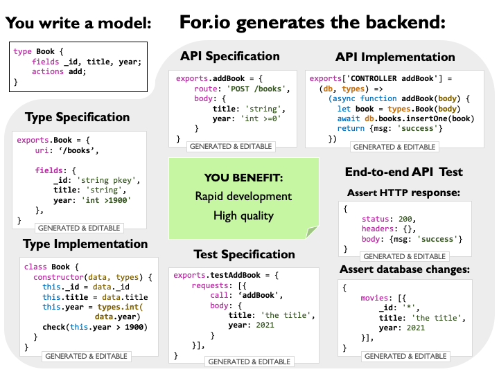
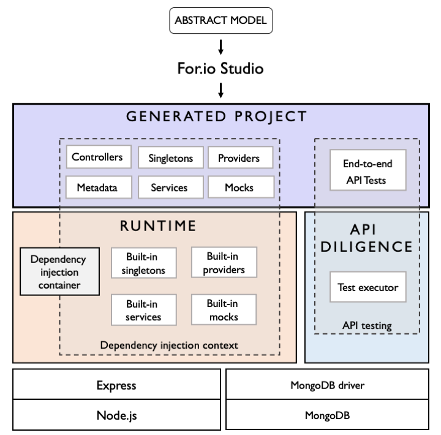

## Architecture


## Project layout

A typical project generated by For.io Studio consists of the following folders:

 - `abstract-model` - this folder contains the abstract model (a.k.a. project specification): data models, api specs, test specs and test data. The abstract model serves as an input for the code generation. It is not needed in run-time, so it doesn’t have to be included in the final build artifacts, e.g. when deploying the backend.

 - `abstract-model/types` - contains type definitions, for instance:


 ```javascript
 // abstract-model/types/Movie.js

 exports.Movie = {
    UID: '1526e0a',
    uri: '/movies',
    fields: {
        _id: 'string pkey autogen',
        title: 'string',
        year: 'int'
    }
}
 ```

 - `abstract-model/api` - contains REST API specifications, for instance:

```javascript
// abstract-model/api/getMovie.js

exports.getMovie = {
    route: 'GET /movies/:movieId',
    title: 'Get movie',
    model: 'Movie:read',
    roles: [],
    params: {
        movieId: 'string'
    },
    query: {},
    headers: {},
    cookies: {},
    middleware: ['auth'],
    responses: [200, 403, 404],
    tags: [],
};

```

- `abstract-model/testdata` - the test data that is referenced in the test specifications, which is used for the generation of the database precondition in the API tests. For instance:

```javascript
// abstract-model/testdata/movies.js

exports.Movie1 = {
    _id: 'movie_1',
    title: 'some title',
    year: 2020
}
```

- `abstract-model/tests` - the API tests specifications, for instance:

```javascript

 // abstract-model/tests/getMovie.js

exports.getMovie = {
    title: 'Get movie',
    users: ['spock'],
    db: {
        movies: ['#Movie1'],
    },
    requests: [{
        call: 'getMovie',
        params: {
            movieId: 'movie_1'
        },
        query: {},
        body: {},
        headers: {},
        cookies: {}
    }],
}
```

- `src` - the backend implementation, consisting of handlers (and other components), for instance:

```javascript
// src/api/getMovie.js

/*
A factory for the controller 'getMovie', using dependency injection
    of singletons: db, types, responses, _.
*/
exports['CONTROLLER getMovie'] = (db, types, responses, _) => {

    // Return the controller, which will be invoked for each request,
    // with the request-scoped dependencies as arguments.
    return async function getMovie(movieId, userId, log) {
        let filter = {
            _id: movieId,
        };

        let data = await db.movies.getOne(filter);
        let movie = types.Movie(data);

        return movie;
    }

}

```

- `test` - manually written tests (units tests & integration tests), mocks and test resources.

- `diligence` - auto-generated, database-aware, end-to-end API tests, typically executed by API Diligence, and are also displayed as test reports in For.io Studio.
